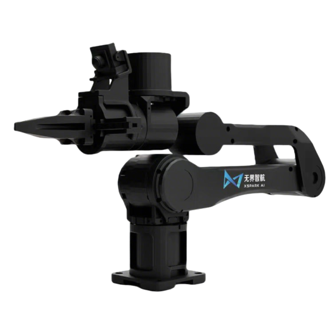
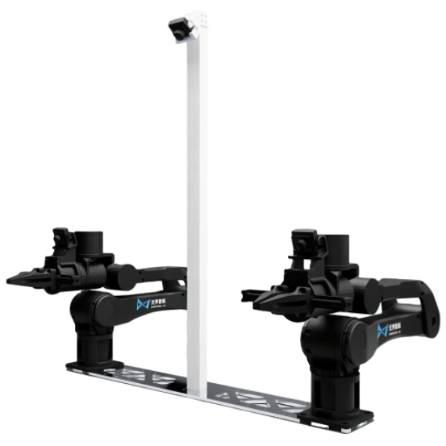

# X-Arm Robot Models and Configuration Repository

This repository provides **technical assets of the X-Arm robot** for simulation and motion planning

## Repository Overview

- **URDF models**
- **Single-arm / Dual-arm USDZ models** 
- **CuRobo motion planning configurations**


## Repository Structure

```text
xarm/
├── preview_image/   
│
├── xarm_curobo_config/           
│   ├── collision_xarm.yml       
│   └── xarm.yml                
│
├── xarm_urdf/                   
│   ├── meshes/                   
│   └── urdf/
│       ├── xarm.srdf          
│       └── xarm.urdf          
│
├── xarm_single-arm.usdz                     
├── xarm_dual-arm.usdz            
│
├── LICENSE
└── README.md

```


## 1. URDF Models

 Path: `xarm_urdf/`
 URDF models describe the **topology and kinematics** of the robot and are used for:

* URDF → USD conversion

- Collision modeling and joint validation

 Typical URDF contents:

- Link and joint definitions
- Joint limits
- Visual and collision meshes


## 2. USDZ Models

-  `xarm.usdz`: single-arm model
-  `xarm_dual-arm.usdz`: dual-arm model

 USDZ models are directly usable in **NVIDIA Isaac Sim** and typically include:

- Full articulation hierarchy
- Physical properties (mass, inertia)
- Collision shapes
- Materials and textures

 Typical use cases:

- Robot simulation


### Model Preview

The image below displays the 3D asset previews for both the single-arm model and the dual-arm model

<table>
<tr>
<td>
<figure style="text-align:center; margin:0;">

</figure>
</td>
<td>
<figure style="text-align:center; margin:0;">

</figure>
</td>
</tr>
</table>


## 3. CuRobo Configuration

 Path: `xarm_curobo_config/`

 This directory contains **CuRobo** configurations defining the robot model for motion planning.

 Typically includes:

- Kinematic / dynamic parameters
- Joint constraints
- Collision spheres or simplified geometry
- Planner and optimizer parameters

 Supported scenarios:

- Single-arm planning
- Batch trajectory generation and testing


## Version (Suggested)

- Isaac Sim: `>= 5.x`

>  Please update according to the validated environment
